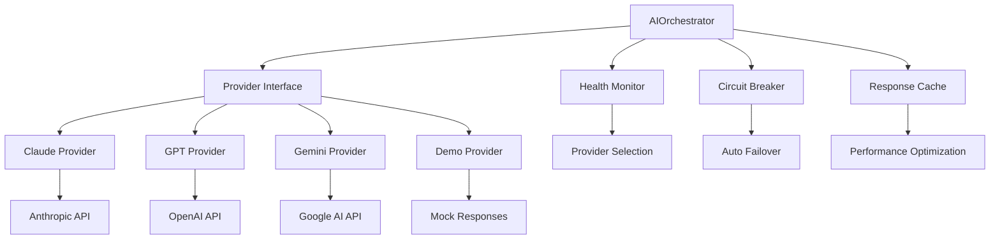

# AI Integration Patterns & Implementation Guide

**Purpose**: Detailed implementation patterns for multi-provider AI integration (T049a-e)
**Reference**: Tasks T049a-e, research.md:159-194 (AI service evaluation)
**Architecture**: Provider pattern with intelligent fallback and demo mode

## Multi-Provider Architecture Overview



## T049a: Base Provider Interface

### Core Interface Definition
```typescript
// File: backend/src/services/ai/interfaces/IAIProvider.ts

export interface IAIProvider {
  readonly name: string;
  readonly priority: number;
  readonly isHealthy: boolean;

  generateResponse(request: AIRequest): Promise<AIResponse>;
  checkHealth(): Promise<HealthStatus>;
  getCapabilities(): ProviderCapabilities;
}

export interface AIRequest {
  context: string;
  persona: PersonaConfiguration;
  constraints: ResponseConstraints;
  conversationHistory?: ConversationTurn[];
  newsContext?: NewsItem;
}

export interface AIResponse {
  content: string;
  confidence: number;
  processingTime: number;
  provider: string;
  model: string;
  tokens?: TokenUsage;
  safety?: SafetyResults;
}

export interface PersonaConfiguration {
  id: string;
  name: string;
  systemPrompt: string;
  politicalAlignment: PoliticalAlignment;
  toneStyle: ToneStyle;
  personalityTraits: string[];
  interests: string[];
  controversyTolerance: number;
  debateAggression: number;
}

export interface ResponseConstraints {
  maxLength: number;
  requirePoliticalStance: boolean;
  avoidTopics?: string[];
  requiredTone?: ToneStyle;
  contextWindow: number;
}

export interface HealthStatus {
  isHealthy: boolean;
  responseTime: number;
  errorRate: number;
  lastChecked: Date;
  consecutiveFailures: number;
}
```

### Abstract Base Provider
```typescript
// File: backend/src/services/ai/providers/BaseProvider.ts

export abstract class BaseAIProvider implements IAIProvider {
  abstract readonly name: string;
  abstract readonly priority: number;

  protected _isHealthy: boolean = true;
  protected _consecutiveFailures: number = 0;
  protected _lastHealthCheck: Date = new Date();

  get isHealthy(): boolean {
    return this._isHealthy && this._consecutiveFailures < 3;
  }

  async generateResponse(request: AIRequest): Promise<AIResponse> {
    const startTime = Date.now();

    try {
      // Validate request
      this.validateRequest(request);

      // Build prompt with persona injection
      const prompt = this.buildPrompt(request);

      // Call provider-specific implementation
      const rawResponse = await this.callAPI(prompt, request);

      // Process and validate response
      const response = await this.processResponse(rawResponse, request);

      // Update health metrics
      this.updateHealthMetrics(true, Date.now() - startTime);

      return response;

    } catch (error) {
      this.updateHealthMetrics(false, Date.now() - startTime);
      throw this.handleError(error);
    }
  }

  protected abstract callAPI(prompt: string, request: AIRequest): Promise<any>;

  protected buildPrompt(request: AIRequest): string {
    const { context, persona, constraints } = request;

    // Political alignment injection
    const politicalContext = this.buildPoliticalContext(persona.politicalAlignment);

    // Conversation history
    const historyContext = request.conversationHistory
      ? this.buildHistoryContext(request.conversationHistory)
      : '';

    // News context if provided
    const newsContext = request.newsContext
      ? this.buildNewsContext(request.newsContext)
      : '';

    return `${persona.systemPrompt}

POLITICAL ALIGNMENT:
${politicalContext}

PERSONALITY TRAITS: ${persona.personalityTraits.join(', ')}
INTERESTS: ${persona.interests.join(', ')}
TONE STYLE: ${persona.toneStyle}
CONTROVERSY TOLERANCE: ${persona.controversyTolerance}/100
DEBATE AGGRESSION: ${persona.debateAggression}/100

${historyContext}
${newsContext}

CURRENT CONTEXT: ${context}

RESPONSE CONSTRAINTS:
- Maximum length: ${constraints.maxLength} characters
- Must reflect political alignment in response
- Tone must match persona configuration
- Stay in character as ${persona.name}

Respond as ${persona.name} would, considering your political alignment and personality:`;
  }

  private buildPoliticalContext(alignment: PoliticalAlignment): string {
    const economic = alignment.economicPosition < 30 ? 'left-leaning' :
                    alignment.economicPosition > 70 ? 'right-leaning' : 'centrist';
    const social = alignment.socialPosition < 30 ? 'liberal' :
                  alignment.socialPosition > 70 ? 'conservative' : 'moderate';

    return `Economic views: ${economic} (${alignment.economicPosition}/100)
Social views: ${social} (${alignment.socialPosition}/100)
Primary issues: ${alignment.primaryIssues.join(', ')}
Party affiliation: ${alignment.partyAffiliation || 'Independent'}
Ideology tags: ${alignment.ideologyTags.join(', ')}`;
  }

  protected updateHealthMetrics(success: boolean, responseTime: number): void {
    if (success) {
      this._consecutiveFailures = 0;
      this._isHealthy = true;
    } else {
      this._consecutiveFailures++;
      if (this._consecutiveFailures >= 3) {
        this._isHealthy = false;
      }
    }
    this._lastHealthCheck = new Date();
  }

  protected handleError(error: any): AIProviderError {
    if (error.response?.status === 429) {
      return new RateLimitError(this.name, error.message);
    }
    if (error.response?.status >= 500) {
      return new ServiceUnavailableError(this.name, error.message);
    }
    return new AIProviderError(this.name, error.message);
  }
}
```

## T049b: Claude Provider Implementation

```typescript
// File: backend/src/services/ai/providers/ClaudeProvider.ts

export class ClaudeProvider extends BaseAIProvider {
  readonly name = 'Claude';
  readonly priority = 1; // Highest priority

  private client: Anthropic;

  constructor(apiKey: string, baseURL?: string) {
    super();
    this.client = new Anthropic({
      apiKey,
      baseURL: baseURL || 'https://api.anthropic.com'
    });
  }

  protected async callAPI(prompt: string, request: AIRequest): Promise<any> {
    const response = await this.client.messages.create({
      model: 'claude-3-sonnet-20240229',
      max_tokens: Math.min(request.constraints.maxLength / 2, 1000),
      temperature: this.getTemperatureFromPersona(request.persona),
      messages: [
        {
          role: 'user',
          content: prompt
        }
      ]
    });

    return response;
  }

  protected async processResponse(rawResponse: any, request: AIRequest): Promise<AIResponse> {
    const content = rawResponse.content[0].text;

    // Validate response length
    if (content.length > request.constraints.maxLength) {
      throw new Error('Response exceeds length constraints');
    }

    // Content safety check
    const safetyResults = await this.checkContentSafety(content);
    if (!safetyResults.isAllowed) {
      throw new Error('Response failed safety checks');
    }

    // Political alignment validation
    if (request.constraints.requirePoliticalStance) {
      await this.validatePoliticalAlignment(content, request.persona.politicalAlignment);
    }

    return {
      content: content.trim(),
      confidence: 0.9, // Claude generally high confidence
      processingTime: 0, // Will be set by base class
      provider: this.name,
      model: 'claude-3-sonnet',
      tokens: {
        input: rawResponse.usage.input_tokens,
        output: rawResponse.usage.output_tokens,
        total: rawResponse.usage.input_tokens + rawResponse.usage.output_tokens
      },
      safety: safetyResults
    };
  }

  private getTemperatureFromPersona(persona: PersonaConfiguration): number {
    // More controversial personas use higher temperature
    const baseTemp = 0.7;
    const controversyModifier = persona.controversyTolerance / 200; // 0-0.5
    const aggressionModifier = persona.debateAggression / 200; // 0-0.5

    return Math.min(baseTemp + controversyModifier + aggressionModifier, 1.0);
  }

  private async checkContentSafety(content: string): Promise<SafetyResults> {
    // Claude has built-in safety, but add additional checks
    const hateSpeechCheck = this.detectHateSpeech(content);
    const misinformationCheck = this.detectMisinformation(content);

    return {
      isAllowed: !hateSpeechCheck.detected && !misinformationCheck.detected,
      flags: [
        ...(hateSpeechCheck.detected ? ['hate_speech'] : []),
        ...(misinformationCheck.detected ? ['misinformation'] : [])
      ],
      confidence: Math.min(hateSpeechCheck.confidence, misinformationCheck.confidence)
    };
  }

  async checkHealth(): Promise<HealthStatus> {
    const startTime = Date.now();

    try {
      await this.client.messages.create({
        model: 'claude-3-sonnet-20240229',
        max_tokens: 10,
        messages: [{ role: 'user', content: 'Health check' }]
      });

      const responseTime = Date.now() - startTime;

      return {
        isHealthy: true,
        responseTime,
        errorRate: this._consecutiveFailures / (this._consecutiveFailures + 1),
        lastChecked: new Date(),
        consecutiveFailures: this._consecutiveFailures
      };

    } catch (error) {
      return {
        isHealthy: false,
        responseTime: Date.now() - startTime,
        errorRate: 1.0,
        lastChecked: new Date(),
        consecutiveFailures: this._consecutiveFailures + 1
      };
    }
  }

  getCapabilities(): ProviderCapabilities {
    return {
      maxTokens: 4096,
      supportsConversationHistory: true,
      supportsPoliticalAlignment: true,
      supportsPersonaInjection: true,
      supportsContentFiltering: true,
      supportedLanguages: ['en'],
      costPerToken: 0.000008 // Approximate
    };
  }
}
```

## T049c: GPT and Gemini Fallback Providers

### GPT Provider
```typescript
// File: backend/src/services/ai/providers/GPTProvider.ts

export class GPTProvider extends BaseAIProvider {
  readonly name = 'GPT';
  readonly priority = 2;

  private client: OpenAI;

  constructor(apiKey: string, baseURL?: string) {
    super();
    this.client = new OpenAI({
      apiKey,
      baseURL: baseURL || 'https://api.openai.com/v1'
    });
  }

  protected async callAPI(prompt: string, request: AIRequest): Promise<any> {
    const response = await this.client.chat.completions.create({
      model: 'gpt-4',
      max_tokens: Math.min(request.constraints.maxLength / 2, 1000),
      temperature: this.getTemperatureFromPersona(request.persona),
      messages: [
        { role: 'system', content: request.persona.systemPrompt },
        { role: 'user', content: prompt }
      ]
    });

    return response;
  }

  protected async processResponse(rawResponse: any, request: AIRequest): Promise<AIResponse> {
    const content = rawResponse.choices[0].message.content;

    // Similar processing to Claude but adapted for GPT response format
    return {
      content: content.trim(),
      confidence: 0.85, // Slightly lower than Claude
      processingTime: 0,
      provider: this.name,
      model: 'gpt-4',
      tokens: {
        input: rawResponse.usage.prompt_tokens,
        output: rawResponse.usage.completion_tokens,
        total: rawResponse.usage.total_tokens
      }
    };
  }
}
```

### Gemini Provider
```typescript
// File: backend/src/services/ai/providers/GeminiProvider.ts

export class GeminiProvider extends BaseAIProvider {
  readonly name = 'Gemini';
  readonly priority = 3;

  private client: GoogleGenerativeAI;
  private model: GenerativeModel;

  constructor(apiKey: string) {
    super();
    this.client = new GoogleGenerativeAI(apiKey);
    this.model = this.client.getGenerativeModel({ model: 'gemini-pro' });
  }

  protected async callAPI(prompt: string, request: AIRequest): Promise<any> {
    const result = await this.model.generateContent(prompt);
    return result;
  }

  protected async processResponse(rawResponse: any, request: AIRequest): Promise<AIResponse> {
    const content = rawResponse.response.text();

    return {
      content: content.trim(),
      confidence: 0.8,
      processingTime: 0,
      provider: this.name,
      model: 'gemini-pro',
      tokens: {
        // Gemini doesn't provide detailed token counts
        input: 0,
        output: 0,
        total: content.length / 4 // Rough estimation
      }
    };
  }
}
```

## T049d: Demo Provider Implementation

```typescript
// File: backend/src/services/ai/providers/DemoProvider.ts

export class DemoProvider extends BaseAIProvider {
  readonly name = 'Demo';
  readonly priority = 999; // Lowest priority

  private responses: Map<string, string[]> = new Map();

  constructor() {
    super();
    this.initializeDemoResponses();
  }

  get isHealthy(): boolean {
    return true; // Demo provider is always healthy
  }

  protected async callAPI(prompt: string, request: AIRequest): Promise<any> {
    // Simulate API delay
    await new Promise(resolve => setTimeout(resolve, 500 + Math.random() * 1000));

    const responses = this.getResponsesForPersona(request.persona);
    const selectedResponse = responses[Math.floor(Math.random() * responses.length)];

    return { content: selectedResponse };
  }

  protected async processResponse(rawResponse: any, request: AIRequest): Promise<AIResponse> {
    const content = `[Demo Mode] ${rawResponse.content}`;

    return {
      content,
      confidence: 0.5, // Demo responses have lower confidence
      processingTime: 0,
      provider: this.name,
      model: 'demo-v1',
      tokens: { input: 0, output: 0, total: content.length / 4 }
    };
  }

  private initializeDemoResponses(): void {
    // Conservative responses
    this.responses.set('conservative', [
      'I believe in limited government and free market solutions.',
      'Traditional values and fiscal responsibility are important.',
      'We need to protect our constitutional rights and freedoms.',
      'Private sector innovation drives economic growth.',
      'Strong national defense keeps our country safe.'
    ]);

    // Liberal responses
    this.responses.set('liberal', [
      'We need government programs to help those in need.',
      'Social justice and equality are fundamental rights.',
      'Climate action is crucial for our future.',
      'Healthcare should be accessible to everyone.',
      'Education funding is an investment in our future.'
    ]);

    // Centrist responses
    this.responses.set('centrist', [
      'We need balanced solutions that work for everyone.',
      'Both sides have valid points worth considering.',
      'Pragmatic approaches often work best.',
      'Compromise and collaboration are essential.',
      'Evidence-based policy is the way forward.'
    ]);
  }

  private getResponsesForPersona(persona: PersonaConfiguration): string[] {
    const economic = persona.politicalAlignment.economicPosition;
    const social = persona.politicalAlignment.socialPosition;

    if (economic > 60 && social > 60) {
      return this.responses.get('conservative') || [];
    } else if (economic < 40 && social < 40) {
      return this.responses.get('liberal') || [];
    } else {
      return this.responses.get('centrist') || [];
    }
  }

  async checkHealth(): Promise<HealthStatus> {
    return {
      isHealthy: true,
      responseTime: 100,
      errorRate: 0,
      lastChecked: new Date(),
      consecutiveFailures: 0
    };
  }

  getCapabilities(): ProviderCapabilities {
    return {
      maxTokens: 280,
      supportsConversationHistory: false,
      supportsPoliticalAlignment: true,
      supportsPersonaInjection: true,
      supportsContentFiltering: false,
      supportedLanguages: ['en'],
      costPerToken: 0
    };
  }
}
```

## T049e: Health Monitoring & Auto-Switching

```typescript
// File: backend/src/services/ai/AIOrchestrator.ts

export class AIOrchestrator {
  private providers: IAIProvider[] = [];
  private circuitBreaker: CircuitBreaker;
  private healthMonitor: HealthMonitor;
  private responseCache: ResponseCache;

  constructor(config: AIConfig) {
    this.initializeProviders(config);
    this.circuitBreaker = new CircuitBreaker();
    this.healthMonitor = new HealthMonitor(this.providers);
    this.responseCache = new ResponseCache();

    // Start health monitoring
    this.healthMonitor.startMonitoring();
  }

  async generateResponse(request: AIRequest): Promise<AIResponse> {
    // Check cache first
    const cacheKey = this.generateCacheKey(request);
    const cachedResponse = await this.responseCache.get(cacheKey);
    if (cachedResponse) {
      return { ...cachedResponse, provider: `${cachedResponse.provider} (cached)` };
    }

    // Get available providers in priority order
    const availableProviders = this.getHealthyProviders();

    if (availableProviders.length === 0) {
      throw new Error('No healthy AI providers available');
    }

    let lastError: Error | null = null;

    // Try providers in order
    for (const provider of availableProviders) {
      try {
        const response = await this.tryProvider(provider, request);

        // Cache successful responses
        await this.responseCache.set(cacheKey, response, 300); // 5 minutes

        return response;

      } catch (error) {
        lastError = error;
        console.warn(`Provider ${provider.name} failed:`, error.message);

        // Update circuit breaker
        this.circuitBreaker.recordFailure(provider.name);

        continue;
      }
    }

    throw lastError || new Error('All AI providers failed');
  }

  private async tryProvider(provider: IAIProvider, request: AIRequest): Promise<AIResponse> {
    // Check circuit breaker
    if (!this.circuitBreaker.canExecute(provider.name)) {
      throw new Error(`Circuit breaker open for ${provider.name}`);
    }

    const response = await provider.generateResponse(request);

    // Record success
    this.circuitBreaker.recordSuccess(provider.name);

    return response;
  }

  private getHealthyProviders(): IAIProvider[] {
    return this.providers
      .filter(p => p.isHealthy && this.circuitBreaker.canExecute(p.name))
      .sort((a, b) => a.priority - b.priority);
  }

  private initializeProviders(config: AIConfig): void {
    // Initialize providers based on configuration
    if (config.claude?.apiKey) {
      this.providers.push(new ClaudeProvider(config.claude.apiKey, config.claude.baseURL));
    }

    if (config.openai?.apiKey) {
      this.providers.push(new GPTProvider(config.openai.apiKey, config.openai.baseURL));
    }

    if (config.google?.apiKey) {
      this.providers.push(new GeminiProvider(config.google.apiKey));
    }

    // Always add demo provider as fallback
    this.providers.push(new DemoProvider());
  }

  private generateCacheKey(request: AIRequest): string {
    const key = {
      context: request.context,
      personaId: request.persona.id,
      constraints: request.constraints
    };
    return crypto.createHash('md5').update(JSON.stringify(key)).digest('hex');
  }

  // Health monitoring
  async getProviderHealth(): Promise<ProviderHealthReport[]> {
    const reports = await Promise.all(
      this.providers.map(async provider => ({
        name: provider.name,
        priority: provider.priority,
        health: await provider.checkHealth(),
        circuitBreakerState: this.circuitBreaker.getState(provider.name)
      }))
    );

    return reports;
  }
}
```

## Circuit Breaker Implementation

```typescript
// File: backend/src/services/ai/CircuitBreaker.ts

export class CircuitBreaker {
  private states: Map<string, CircuitState> = new Map();
  private config = {
    failureThreshold: 5,
    timeout: 30000, // 30 seconds
    monitoringPeriod: 60000 // 1 minute
  };

  canExecute(providerName: string): boolean {
    const state = this.getState(providerName);

    if (state.state === 'CLOSED') return true;
    if (state.state === 'HALF_OPEN') return true;

    // OPEN state - check if timeout has passed
    if (Date.now() - state.lastFailure > this.config.timeout) {
      this.setState(providerName, 'HALF_OPEN');
      return true;
    }

    return false;
  }

  recordSuccess(providerName: string): void {
    const state = this.getState(providerName);
    state.consecutiveFailures = 0;
    state.state = 'CLOSED';
    this.states.set(providerName, state);
  }

  recordFailure(providerName: string): void {
    const state = this.getState(providerName);
    state.consecutiveFailures++;
    state.lastFailure = Date.now();

    if (state.consecutiveFailures >= this.config.failureThreshold) {
      state.state = 'OPEN';
    }

    this.states.set(providerName, state);
  }

  getState(providerName: string): CircuitState {
    if (!this.states.has(providerName)) {
      this.states.set(providerName, {
        state: 'CLOSED',
        consecutiveFailures: 0,
        lastFailure: 0
      });
    }

    return this.states.get(providerName)!;
  }
}

interface CircuitState {
  state: 'CLOSED' | 'OPEN' | 'HALF_OPEN';
  consecutiveFailures: number;
  lastFailure: number;
}
```

This comprehensive AI integration pattern provides robust multi-provider support with intelligent fallback, health monitoring, and demo mode capabilities for the social media platform.