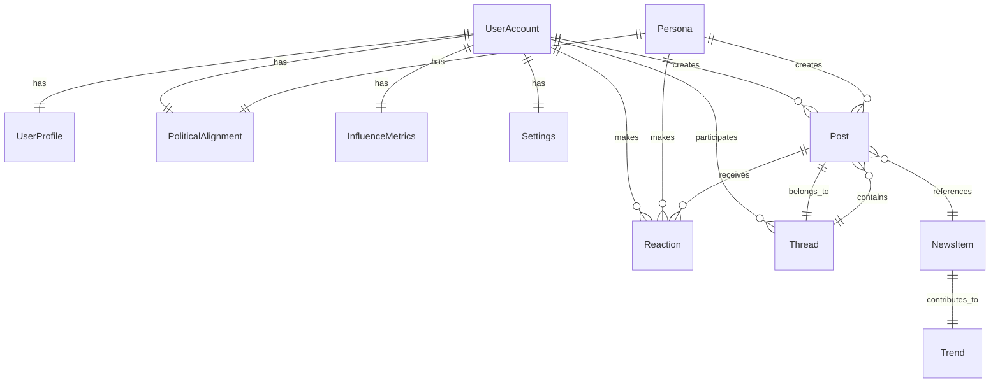

# Data Model: Politician/Influencer Social Media Simulator

**Date**: 2025-09-16  
**Phase**: 1 - Design & Contracts  
**Database**: PostgreSQL with Prisma ORM

## Entity Relationship Overview



## Core Entities

### 1. UserAccount
Represents an authenticated user with customizable politician/influencer persona.

```typescript
interface UserAccount {
  id: string;                    // UUID primary key
  username: string;              // Unique handle (@username)
  email: string;                 // For authentication (unique)
  passwordHash: string;          // Hashed password
  emailVerified: boolean;        // Email verification status
  createdAt: Date;              // Account creation timestamp
  updatedAt: Date;              // Last profile update
  isActive: boolean;            // Account status
  lastLoginAt: Date | null;     // Last login tracking
  
  // Relationships
  profile: UserProfile;
  politicalAlignment: PoliticalAlignment;
  influenceMetrics: InfluenceMetrics;
  settings: Settings;
  posts: Post[];
  reactions: Reaction[];
}
```

**Validation Rules**:
- Username: 3-15 characters, alphanumeric + underscore, unique
- Email: Valid email format, unique
- Password: Minimum 8 characters, complexity requirements

### 2. UserProfile
Public-facing persona including profile picture, bio, specialty areas, and political alignment.

```typescript
interface UserProfile {
  id: string;                    // UUID primary key
  userId: string;               // Foreign key to UserAccount
  displayName: string;          // Public display name
  bio: string | null;           // User biography (280 chars max)
  profileImageUrl: string | null; // Profile picture URL
  headerImageUrl: string | null;  // Header/banner image URL
  location: string | null;      // User location
  website: string | null;       // Personal website URL
  
  // Persona-specific fields
  personaType: PersonaType;     // POLITICIAN | INFLUENCER | JOURNALIST | ACTIVIST
  specialtyAreas: string[];     // Areas of expertise/interest
  verificationBadge: boolean;   // Verification status
  
  // Engagement metrics (denormalized for performance)
  followerCount: number;        // Current follower count
  followingCount: number;       // Following count
  postCount: number;           // Total posts created
  
  createdAt: Date;
  updatedAt: Date;
}

enum PersonaType {
  POLITICIAN = "POLITICIAN",
  INFLUENCER = "INFLUENCER", 
  JOURNALIST = "JOURNALIST",
  ACTIVIST = "ACTIVIST",
  BUSINESS = "BUSINESS",
  ENTERTAINER = "ENTERTAINER"
}
```

**Validation Rules**:
- Display name: 1-50 characters
- Bio: Maximum 280 characters
- URL fields: Valid URL format if provided
- Specialty areas: Maximum 5 areas, each 1-30 characters

### 3. PoliticalAlignment
User's political stance and ideological positions that influence AI persona interactions.

```typescript
interface PoliticalAlignment {
  id: string;                   // UUID primary key
  userId: string;              // Foreign key to UserAccount
  
  // Political spectrum positioning (0-100 scale)
  economicPosition: number;    // 0=left, 50=center, 100=right
  socialPosition: number;      // 0=liberal, 50=moderate, 100=conservative
  
  // Specific stances
  primaryIssues: string[];     // Top 5 political issues of interest
  partyAffiliation: string | null; // Political party (optional)
  ideologyTags: string[];      // Ideological labels
  
  // Engagement preferences
  debateWillingness: number;   // 0-100: How willing to engage in political debate
  controversyTolerance: number; // 0-100: Tolerance for controversial topics
  
  createdAt: Date;
  updatedAt: Date;
}
```

**Validation Rules**:
- Position values: 0-100 range
- Primary issues: Maximum 5 items, each 2-50 characters
- Ideology tags: Maximum 10 tags, each 2-30 characters
- Willingness/tolerance: 0-100 range

### 4. InfluenceMetrics
User progression data including follower count, engagement rate, approval rating, controversy level.

```typescript
interface InfluenceMetrics {
  id: string;                   // UUID primary key
  userId: string;              // Foreign key to UserAccount
  
  // Core metrics
  followerCount: number;       // Current followers
  followingCount: number;      // Users following
  engagementRate: number;      // Average engagement percentage
  reachScore: number;          // Calculated reach influence
  
  // Politician/Influencer specific metrics
  approvalRating: number;      // 0-100 approval rating
  controversyLevel: number;    // 0-100 controversy meter
  trendingScore: number;       // Current trending influence
  
  // Growth tracking
  followerGrowthDaily: number;   // Daily follower change
  followerGrowthWeekly: number;  // Weekly follower change
  followerGrowthMonthly: number; // Monthly follower change
  
  // Engagement breakdown
  totalLikes: number;          // Lifetime likes received
  totalReshares: number;       // Lifetime reshares
  totalComments: number;       // Lifetime comments received
  
  // Calculated fields
  influenceRank: number;       // Global influence ranking
  categoryRank: number;        // Rank within persona category
  
  lastUpdated: Date;           // Last metrics calculation
  createdAt: Date;
}
```

**Business Rules**:
- Metrics updated daily via background job
- Engagement rate calculated as (likes + comments + reshares) / impressions
- Influence rank updated weekly across all users
- Approval rating based on positive vs negative reactions

### 5. Post
Short text update created by humans or AI personas.

```typescript
interface Post {
  id: string;                  // UUID primary key
  authorId: string;           // Foreign key to UserAccount
  personaId: string | null;   // Foreign key to Persona (if AI-generated)
  
  // Content
  content: string;            // Post text (280 chars max)
  mediaUrls: string[];        // Attached media URLs
  linkPreview: LinkPreview | null; // Generated link preview
  
  // Threading
  threadId: string;           // Foreign key to Thread
  parentPostId: string | null; // Reply to another post
  repostOfId: string | null;  // If this is a repost/retweet
  
  // Metadata
  isAIGenerated: boolean;     // Flag for AI-generated content
  hashtags: string[];         // Extracted hashtags
  mentions: string[];         // @username mentions
  
  // News integration
  newsItemId: string | null;  // Foreign key to NewsItem
  newsContext: string | null; // News context for AI responses
  
  // Engagement metrics (denormalized)
  likeCount: number;          // Current like count
  repostCount: number;        // Repost/retweet count
  commentCount: number;       // Reply count
  impressionCount: number;    // View count
  
  // Moderation
  contentWarning: string | null; // Content warning label
  isHidden: boolean;          // Hidden by moderation
  reportCount: number;        // Number of reports
  
  // Timestamps
  publishedAt: Date;          // When post was published
  editedAt: Date | null;      // Last edit timestamp
  createdAt: Date;
  updatedAt: Date;
}

interface LinkPreview {
  url: string;
  title: string;
  description: string;
  imageUrl: string | null;
  siteName: string;
}
```

**Validation Rules**:
- Content: 1-280 characters
- Media URLs: Maximum 4 media items
- Hashtags: Maximum 10 per post
- Mentions: Maximum 10 per post

### 6. Persona
AI character with configurable name, bio, interests, tone settings, posting frequency.

```typescript
interface Persona {
  id: string;                  // UUID primary key
  name: string;               // Persona display name
  handle: string;             // Unique @handle for persona
  bio: string;                // Persona description
  profileImageUrl: string;    // AI persona avatar
  
  // Personality configuration
  personaType: PersonaType;   // Type of persona
  personalityTraits: string[]; // Personality descriptors
  interests: string[];        // Topics of interest
  expertise: string[];        // Areas of expertise
  
  // Behavioral parameters
  toneStyle: ToneStyle;       // Communication style
  controversyTolerance: number; // 0-100: How controversial persona gets
  engagementFrequency: number; // 0-100: How often persona posts/replies
  debateAggression: number;   // 0-100: How aggressively persona debates
  
  // Political alignment
  politicalAlignment: PoliticalAlignment;
  
  // AI configuration
  aiProvider: string;         // Which AI service to use
  systemPrompt: string;       // Base prompt for AI responses
  contextWindow: number;      // How much conversation history to include
  
  // Scheduling
  postingSchedule: PostingSchedule; // When persona posts automatically
  timezonePreference: string; // Timezone for scheduling
  
  // Status
  isActive: boolean;          // Whether persona is responding
  isDefault: boolean;         // Default/built-in persona
  
  createdAt: Date;
  updatedAt: Date;
}

enum ToneStyle {
  PROFESSIONAL = "PROFESSIONAL",
  CASUAL = "CASUAL", 
  HUMOROUS = "HUMOROUS",
  SERIOUS = "SERIOUS",
  SARCASTIC = "SARCASTIC",
  EMPATHETIC = "EMPATHETIC"
}

interface PostingSchedule {
  enabled: boolean;
  postsPerDay: number;        // Target posts per day
  activeHours: number[];      // Hours of day when active (0-23)
  activeDays: number[];       // Days of week when active (0-6)
  newsReactionChance: number; // 0-100: Chance to react to news
}
```

**Validation Rules**:
- Name: 1-50 characters
- Handle: 3-15 characters, unique across personas
- Bio: 1-500 characters
- Interests/expertise: Maximum 10 items each
- Tolerance/frequency/aggression: 0-100 range

### 7. Thread
Conversation chain including original post and all replies.

```typescript
interface Thread {
  id: string;                 // UUID primary key
  originalPostId: string;     // First post in thread
  title: string | null;       // Optional thread title
  
  // Thread metadata
  participantCount: number;   // Number of unique participants
  postCount: number;         // Total posts in thread
  maxDepth: number;          // Maximum reply depth
  
  // Engagement
  totalLikes: number;        // Likes across all posts
  totalReshares: number;     // Reshares of thread posts
  lastActivityAt: Date;      // Last post/reaction timestamp
  
  // Moderation
  isLocked: boolean;         // Thread locked from new replies
  isHidden: boolean;         // Thread hidden by moderation
  
  createdAt: Date;
  updatedAt: Date;
  
  // Relationships
  posts: Post[];
}
```

### 8. Reaction
User engagement with posts through simple interaction mechanisms.

```typescript
interface Reaction {
  id: string;                // UUID primary key
  userId: string;           // Foreign key to UserAccount
  postId: string;           // Foreign key to Post
  
  type: ReactionType;       // Type of reaction
  createdAt: Date;
  
  // Composite unique constraint on (userId, postId, type)
}

enum ReactionType {
  LIKE = "LIKE",
  REPOST = "REPOST",
  BOOKMARK = "BOOKMARK",
  REPORT = "REPORT"
}
```

### 9. NewsItem
Normalized news event with source, timestamp, region, and topic tags.

```typescript
interface NewsItem {
  id: string;               // UUID primary key
  
  // Core content
  title: string;            // News headline
  description: string;      // News summary
  content: string | null;   // Full article content
  url: string;             // Original article URL
  
  // Source information
  sourceName: string;       // News source name
  sourceUrl: string;        // News source base URL
  author: string | null;    // Article author
  
  // Classification
  category: NewsCategory;   // News category
  topics: string[];         // Extracted topics
  keywords: string[];       // Important keywords
  entities: string[];       // Named entities (people, places, orgs)
  
  // Geolocation
  country: string | null;   // Country code (ISO 3166-1)
  region: string | null;    // Geographic region
  language: string;         // Content language (ISO 639-1)
  
  // Sentiment and impact
  sentimentScore: number;   // -1 to 1 sentiment
  impactScore: number;      // 0-100 estimated impact
  controversyScore: number; // 0-100 controversy level
  
  // Timestamps
  publishedAt: Date;        // Original publication time
  discoveredAt: Date;       // When our system found it
  createdAt: Date;
  updatedAt: Date;
  
  // AI analysis
  aiSummary: string | null; // AI-generated summary
  topicTags: string[];      // AI-extracted topic tags
  
  // Relationships
  trends: Trend[];
  relatedPosts: Post[];
}

enum NewsCategory {
  POLITICS = "POLITICS",
  BUSINESS = "BUSINESS",
  TECHNOLOGY = "TECHNOLOGY",
  SPORTS = "SPORTS",
  ENTERTAINMENT = "ENTERTAINMENT",
  HEALTH = "HEALTH",
  SCIENCE = "SCIENCE",
  WORLD = "WORLD",
  LOCAL = "LOCAL"
}
```

### 10. Trend
Topic or hashtag with activity metrics over the past 24 hours.

```typescript
interface Trend {
  id: string;               // UUID primary key
  
  // Trend identification
  hashtag: string | null;   // Trending hashtag
  keyword: string | null;   // Trending keyword/phrase
  topic: string;           // Normalized topic name
  
  // Metrics (24-hour window)
  postCount: number;        // Posts mentioning this trend
  uniqueUsers: number;      // Unique users posting about trend
  impressionCount: number;  // Total impressions
  engagementCount: number;  // Total engagements (likes, shares, comments)
  
  // Scoring
  trendScore: number;       // Calculated trending score (0-100)
  velocity: number;         // Rate of growth
  peakTime: Date | null;    // When trend peaked
  
  // Classification
  category: TrendCategory;  // Type of trend
  region: string | null;    // Geographic focus (if applicable)
  language: string;         // Primary language
  
  // Status
  isPromoted: boolean;      // Artificially promoted trend
  isHidden: boolean;        // Hidden by moderation
  
  // Time tracking
  startedAt: Date;          // When trend began
  endedAt: Date | null;     // When trend ended (if applicable)
  lastUpdated: Date;        // Last metrics update
  createdAt: Date;
}

enum TrendCategory {
  BREAKING_NEWS = "BREAKING_NEWS",
  POLITICS = "POLITICS", 
  ENTERTAINMENT = "ENTERTAINMENT",
  SPORTS = "SPORTS",
  TECHNOLOGY = "TECHNOLOGY",
  MEME = "MEME",
  HASHTAG_GAME = "HASHTAG_GAME",
  OTHER = "OTHER"
}
```

### 11. Settings
User preferences including news region, AI chatter level, and API configuration.

```typescript
interface Settings {
  id: string;               // UUID primary key
  userId: string;          // Foreign key to UserAccount
  
  // News preferences
  newsRegion: string;       // ISO country code or "WORLDWIDE"
  newsCategories: NewsCategory[]; // Subscribed news categories
  newsLanguages: string[];  // Preferred news languages
  
  // AI interaction preferences
  aiChatterLevel: number;   // 0-100: How much AI interaction user wants
  aiPersonalities: string[]; // Preferred AI persona types
  aiResponseTone: ToneStyle; // Preferred AI response style
  
  // Notification preferences
  emailNotifications: boolean;
  pushNotifications: boolean;
  notificationCategories: NotificationCategory[];
  
  // Privacy settings
  profileVisibility: ProfileVisibility;
  allowPersonaInteractions: boolean;
  allowDataForAI: boolean;
  
  // Display preferences
  theme: Theme;             // UI theme preference
  language: string;         // UI language
  timezone: string;         // User timezone
  
  // API configuration (for power users)
  customAIApiKey: string | null;   // Custom AI API key
  customAIBaseUrl: string | null;  // Custom AI service URL
  
  createdAt: Date;
  updatedAt: Date;
}

enum NotificationCategory {
  MENTIONS = "MENTIONS",
  REPLIES = "REPLIES", 
  LIKES = "LIKES",
  REPOSTS = "REPOSTS",
  FOLLOWERS = "FOLLOWERS",
  NEWS_ALERTS = "NEWS_ALERTS",
  PERSONA_INTERACTIONS = "PERSONA_INTERACTIONS"
}

enum ProfileVisibility {
  PUBLIC = "PUBLIC",
  FOLLOWERS_ONLY = "FOLLOWERS_ONLY",
  PRIVATE = "PRIVATE"
}

enum Theme {
  LIGHT = "LIGHT",
  DARK = "DARK",
  AUTO = "AUTO"
}
```

## Database Constraints and Indexes

### Primary Keys
All entities use UUID primary keys for:
- Global uniqueness across distributed systems
- Better security (non-sequential IDs)
- Simplified database sharding

### Unique Constraints
```sql
-- User uniqueness
UNIQUE(UserAccount.username)
UNIQUE(UserAccount.email)
UNIQUE(Persona.handle)

-- Reaction uniqueness (prevent duplicate reactions)
UNIQUE(Reaction.userId, Reaction.postId, Reaction.type)

-- Thread integrity
UNIQUE(Thread.originalPostId)
```

### Performance Indexes
```sql
-- Timeline queries
CREATE INDEX idx_posts_timeline ON Post(publishedAt DESC, isHidden);
CREATE INDEX idx_posts_author ON Post(authorId, publishedAt DESC);

-- Thread queries  
CREATE INDEX idx_posts_thread ON Post(threadId, createdAt);
CREATE INDEX idx_posts_parent ON Post(parentPostId);

-- User engagement
CREATE INDEX idx_reactions_post ON Reaction(postId, type);
CREATE INDEX idx_reactions_user ON Reaction(userId, createdAt DESC);

-- News and trends
CREATE INDEX idx_news_published ON NewsItem(publishedAt DESC, category);
CREATE INDEX idx_trends_score ON Trend(trendScore DESC, lastUpdated DESC);

-- Search functionality
CREATE INDEX idx_posts_content_search ON Post USING gin(to_tsvector('english', content));
CREATE INDEX idx_news_content_search ON NewsItem USING gin(to_tsvector('english', title || ' ' || description));
```

### Foreign Key Relationships
All foreign keys include CASCADE DELETE for clean data removal:
```sql
-- User relationships
UserProfile.userId → UserAccount.id ON DELETE CASCADE
PoliticalAlignment.userId → UserAccount.id ON DELETE CASCADE
InfluenceMetrics.userId → UserAccount.id ON DELETE CASCADE
Settings.userId → UserAccount.id ON DELETE CASCADE

-- Content relationships
Post.authorId → UserAccount.id ON DELETE SET NULL
Post.personaId → Persona.id ON DELETE SET NULL
Post.threadId → Thread.id ON DELETE CASCADE
Post.parentPostId → Post.id ON DELETE SET NULL

-- Engagement relationships
Reaction.userId → UserAccount.id ON DELETE CASCADE
Reaction.postId → Post.id ON DELETE CASCADE
```

## Data Validation and Business Rules

### Content Moderation
- Post content filtered for hate speech using AI moderation
- Automatic flagging based on report count thresholds
- Shadow banning for repeat offenders

### Influence Calculation
- Metrics updated daily via background jobs
- Engagement rate = (reactions + comments + reposts) / impressions
- Approval rating based on positive vs negative sentiment analysis
- Controversy level calculated from content sentiment and engagement patterns

### AI Persona Behavior
- Posting frequency controlled by schedule configuration
- Response probability based on political alignment similarity
- Context window management for conversation continuity
- Rate limiting to prevent spam-like behavior

### News Integration
- Duplicate detection using title and URL similarity
- Topic extraction using NLP and keyword analysis
- Regional filtering based on content analysis and source location
- Sentiment scoring for appropriate AI persona reactions

---

This data model provides a comprehensive foundation for the politician/influencer social media simulator, supporting all functional requirements while maintaining performance and scalability.