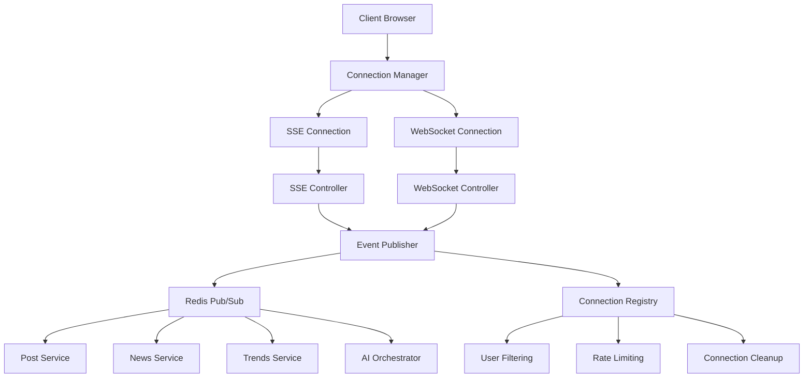

# Real-time Architecture Implementation Guide

**Purpose**: Detailed implementation patterns for SSE + WebSocket hybrid real-time features (T053a-c)
**Reference**: Tasks T053a-c, research.md:324-335 (real-time patterns)
**Architecture**: Server-Sent Events for timeline updates + WebSockets for interactive features

## Real-time Architecture Overview



## T053a: Server-Sent Events Implementation

### SSE Controller
```typescript
// File: backend/src/services/realtime/SSEController.ts

export class SSEController {
  private connections: Map<string, SSEConnection> = new Map();
  private eventPublisher: EventPublisher;
  private rateLimiter: RateLimiter;

  constructor(eventPublisher: EventPublisher) {
    this.eventPublisher = eventPublisher;
    this.rateLimiter = new RateLimiter();

    // Subscribe to events
    this.eventPublisher.subscribe('post_created', this.handlePostCreated.bind(this));
    this.eventPublisher.subscribe('post_reaction', this.handlePostReaction.bind(this));
    this.eventPublisher.subscribe('trend_update', this.handleTrendUpdate.bind(this));
    this.eventPublisher.subscribe('news_item', this.handleNewsItem.bind(this));
    this.eventPublisher.subscribe('ai_response', this.handleAIResponse.bind(this));
  }

  async handleConnection(req: Request, res: Response): Promise<void> {
    const userId = req.user?.id;
    const connectionId = generateConnectionId();

    // Set SSE headers
    res.writeHead(200, {
      'Content-Type': 'text/event-stream',
      'Cache-Control': 'no-cache',
      'Connection': 'keep-alive',
      'Access-Control-Allow-Origin': '*',
      'Access-Control-Allow-Headers': 'Cache-Control'
    });

    // Send initial connection event
    this.sendEvent(res, {
      type: 'connection',
      data: { connectionId, timestamp: new Date().toISOString() }
    });

    // Create connection object
    const connection: SSEConnection = {
      id: connectionId,
      userId,
      response: res,
      connectedAt: new Date(),
      lastActivity: new Date(),
      subscriptions: this.getDefaultSubscriptions(req.query.types as string),
      filters: await this.getUserFilters(userId)
    };

    this.connections.set(connectionId, connection);

    // Handle client disconnect
    req.on('close', () => {
      this.handleDisconnect(connectionId);
    });

    // Send keepalive every 30 seconds
    const keepalive = setInterval(() => {
      if (this.connections.has(connectionId)) {
        this.sendEvent(res, { type: 'keepalive', data: { timestamp: new Date().toISOString() } });
      } else {
        clearInterval(keepalive);
      }
    }, 30000);
  }

  private async handlePostCreated(event: PostCreatedEvent): Promise<void> {
    const relevantConnections = this.getConnectionsForEvent('posts', event);

    for (const connection of relevantConnections) {
      if (await this.shouldSendToUser(connection, event)) {
        this.sendEvent(connection.response, {
          type: 'post_created',
          id: event.postId,
          data: {
            post: event.post,
            author: event.author,
            timestamp: event.timestamp
          }
        });
      }
    }
  }

  private async handlePostReaction(event: PostReactionEvent): Promise<void> {
    const relevantConnections = this.getConnectionsForEvent('reactions', event);

    for (const connection of relevantConnections) {
      // Only send if user is viewing the post or is the author
      if (await this.isRelevantReaction(connection, event)) {
        this.sendEvent(connection.response, {
          type: 'post_reaction',
          id: event.postId,
          data: {
            postId: event.postId,
            reactionType: event.type,
            count: event.newCount,
            userId: event.userId
          }
        });
      }
    }
  }

  private async handleTrendUpdate(event: TrendUpdateEvent): Promise<void> {
    const relevantConnections = this.getConnectionsForEvent('trends', event);

    for (const connection of relevantConnections) {
      // Filter trends by user's region preferences
      if (await this.isTrendRelevant(connection, event.trend)) {
        this.sendEvent(connection.response, {
          type: 'trend_update',
          data: {
            trend: event.trend,
            action: event.action, // 'new', 'update', 'expired'
            timestamp: event.timestamp
          }
        });
      }
    }
  }

  private async handleAIResponse(event: AIResponseEvent): Promise<void> {
    // Send AI responses in real-time to create dynamic conversation feel
    const relevantConnections = this.getConnectionsForEvent('posts', event);

    for (const connection of relevantConnections) {
      if (await this.shouldSendToUser(connection, event)) {
        this.sendEvent(connection.response, {
          type: 'ai_response',
          id: event.responseId,
          data: {
            post: event.post,
            persona: event.persona,
            inReplyTo: event.originalPostId,
            timestamp: event.timestamp
          }
        });
      }
    }
  }

  private sendEvent(res: Response, event: SSEEvent): void {
    try {
      const eventData = `id: ${event.id || Date.now()}\n` +
                       `event: ${event.type}\n` +
                       `data: ${JSON.stringify(event.data)}\n\n`;

      res.write(eventData);
    } catch (error) {
      console.error('Failed to send SSE event:', error);
    }
  }

  private getConnectionsForEvent(eventType: string, event: any): SSEConnection[] {
    return Array.from(this.connections.values())
      .filter(conn => conn.subscriptions.includes(eventType))
      .filter(conn => !this.rateLimiter.isRateLimited(conn.id));
  }

  private async shouldSendToUser(connection: SSEConnection, event: any): Promise<boolean> {
    // Apply user-specific filtering
    if (!connection.filters) return true;

    // Don't send user's own posts back to them
    if (event.authorId === connection.userId) return false;

    // Apply content filters
    if (connection.filters.blockedUsers?.includes(event.authorId)) return false;
    if (connection.filters.blockedTopics?.some(topic => event.content?.includes(topic))) return false;

    // Apply political alignment filtering if configured
    if (connection.filters.politicalFilter && event.author?.politicalAlignment) {
      return this.isPoliticallyRelevant(connection.filters.politicalFilter, event.author.politicalAlignment);
    }

    return true;
  }

  private handleDisconnect(connectionId: string): void {
    const connection = this.connections.get(connectionId);
    if (connection) {
      connection.response.end();
      this.connections.delete(connectionId);
      console.log(`SSE connection ${connectionId} disconnected`);
    }
  }

  // Connection management
  getActiveConnections(): number {
    return this.connections.size;
  }

  getConnectionsByUser(userId: string): SSEConnection[] {
    return Array.from(this.connections.values())
      .filter(conn => conn.userId === userId);
  }

  disconnectUser(userId: string): void {
    const userConnections = this.getConnectionsByUser(userId);
    userConnections.forEach(conn => this.handleDisconnect(conn.id));
  }

  // Cleanup stale connections
  cleanupStaleConnections(): void {
    const now = new Date();
    const staleTimeout = 5 * 60 * 1000; // 5 minutes

    for (const [connectionId, connection] of this.connections) {
      if (now.getTime() - connection.lastActivity.getTime() > staleTimeout) {
        this.handleDisconnect(connectionId);
      }
    }
  }
}

interface SSEConnection {
  id: string;
  userId?: string;
  response: Response;
  connectedAt: Date;
  lastActivity: Date;
  subscriptions: string[];
  filters?: UserFilters;
}

interface SSEEvent {
  type: string;
  id?: string;
  data: any;
}

interface UserFilters {
  blockedUsers?: string[];
  blockedTopics?: string[];
  politicalFilter?: PoliticalFilter;
}
```

### Event Publisher (Redis Pub/Sub)
```typescript
// File: backend/src/services/realtime/EventPublisher.ts

export class EventPublisher {
  private redis: Redis;
  private subscribers: Map<string, EventHandler[]> = new Map();

  constructor(redisUrl: string) {
    this.redis = new Redis(redisUrl);
    this.setupRedisSubscriptions();
  }

  async publish(eventType: string, data: any): Promise<void> {
    const event = {
      type: eventType,
      data,
      timestamp: new Date().toISOString(),
      id: generateEventId()
    };

    // Publish to Redis for cross-instance communication
    await this.redis.publish(`events:${eventType}`, JSON.stringify(event));

    // Notify local subscribers
    const handlers = this.subscribers.get(eventType) || [];
    for (const handler of handlers) {
      try {
        await handler(event);
      } catch (error) {
        console.error(`Event handler error for ${eventType}:`, error);
      }
    }
  }

  subscribe(eventType: string, handler: EventHandler): void {
    if (!this.subscribers.has(eventType)) {
      this.subscribers.set(eventType, []);
    }
    this.subscribers.get(eventType)!.push(handler);
  }

  private setupRedisSubscriptions(): void {
    const subscriber = this.redis.duplicate();

    subscriber.on('message', (channel: string, message: string) => {
      try {
        const eventType = channel.replace('events:', '');
        const event = JSON.parse(message);

        const handlers = this.subscribers.get(eventType) || [];
        handlers.forEach(handler => handler(event));
      } catch (error) {
        console.error('Redis message processing error:', error);
      }
    });

    // Subscribe to all event channels
    subscriber.psubscribe('events:*');
  }

  // Convenience methods for common events
  async publishPostCreated(post: Post, author: UserProfile): Promise<void> {
    await this.publish('post_created', {
      postId: post.id,
      post,
      author,
      authorId: author.id
    });
  }

  async publishPostReaction(postId: string, userId: string, type: ReactionType, newCount: number): Promise<void> {
    await this.publish('post_reaction', {
      postId,
      userId,
      type,
      newCount
    });
  }

  async publishTrendUpdate(trend: Trend, action: 'new' | 'update' | 'expired'): Promise<void> {
    await this.publish('trend_update', {
      trend,
      action
    });
  }

  async publishAIResponse(post: Post, persona: Persona, originalPostId?: string): Promise<void> {
    await this.publish('ai_response', {
      responseId: post.id,
      post,
      persona,
      originalPostId
    });
  }
}

type EventHandler = (event: any) => Promise<void>;
```

## T053b: WebSocket Implementation

```typescript
// File: backend/src/services/realtime/WebSocketController.ts

export class WebSocketController {
  private wss: WebSocketServer;
  private connections: Map<string, WSConnection> = new Map();
  private eventPublisher: EventPublisher;

  constructor(server: Server, eventPublisher: EventPublisher) {
    this.eventPublisher = eventPublisher;
    this.wss = new WebSocketServer({ server, path: '/ws' });

    this.wss.on('connection', this.handleConnection.bind(this));
    this.setupHeartbeat();
  }

  private async handleConnection(ws: WebSocket, req: IncomingMessage): Promise<void> {
    const connectionId = generateConnectionId();
    const userId = await this.authenticateConnection(req);

    if (!userId) {
      ws.close(1008, 'Authentication required');
      return;
    }

    const connection: WSConnection = {
      id: connectionId,
      userId,
      socket: ws,
      connectedAt: new Date(),
      lastPing: new Date(),
      subscriptions: new Set(),
      isAlive: true
    };

    this.connections.set(connectionId, connection);

    // Setup message handling
    ws.on('message', (data) => this.handleMessage(connectionId, data));
    ws.on('close', () => this.handleDisconnect(connectionId));
    ws.on('error', (error) => this.handleError(connectionId, error));

    // Setup pong handling for heartbeat
    ws.on('pong', () => {
      connection.lastPing = new Date();
      connection.isAlive = true;
    });

    // Send welcome message
    this.sendMessage(connectionId, {
      type: 'connection_established',
      data: { connectionId, userId }
    });
  }

  private async handleMessage(connectionId: string, data: WebSocket.Data): Promise<void> {
    const connection = this.connections.get(connectionId);
    if (!connection) return;

    try {
      const message = JSON.parse(data.toString());

      switch (message.type) {
        case 'subscribe':
          await this.handleSubscribe(connection, message.data);
          break;

        case 'unsubscribe':
          await this.handleUnsubscribe(connection, message.data);
          break;

        case 'typing_start':
          await this.handleTypingStart(connection, message.data);
          break;

        case 'typing_stop':
          await this.handleTypingStop(connection, message.data);
          break;

        case 'ping':
          this.sendMessage(connectionId, { type: 'pong', data: { timestamp: Date.now() } });
          break;

        default:
          console.warn(`Unknown WebSocket message type: ${message.type}`);
      }
    } catch (error) {
      console.error('WebSocket message handling error:', error);
      this.sendMessage(connectionId, {
        type: 'error',
        data: { message: 'Invalid message format' }
      });
    }
  }

  private async handleSubscribe(connection: WSConnection, data: any): Promise<void> {
    const { channel } = data;

    if (this.isValidChannel(channel)) {
      connection.subscriptions.add(channel);
      this.sendMessage(connection.id, {
        type: 'subscribed',
        data: { channel }
      });
    } else {
      this.sendMessage(connection.id, {
        type: 'error',
        data: { message: `Invalid channel: ${channel}` }
      });
    }
  }

  private async handleTypingStart(connection: WSConnection, data: any): Promise<void> {
    const { threadId } = data;

    // Broadcast typing indicator to other users in the thread
    await this.broadcastToThread(threadId, {
      type: 'user_typing',
      data: {
        userId: connection.userId,
        threadId,
        action: 'start'
      }
    }, connection.userId);

    // Set timeout to auto-stop typing
    setTimeout(() => {
      this.handleTypingStop(connection, data);
    }, 5000);
  }

  private async handleTypingStop(connection: WSConnection, data: any): Promise<void> {
    const { threadId } = data;

    await this.broadcastToThread(threadId, {
      type: 'user_typing',
      data: {
        userId: connection.userId,
        threadId,
        action: 'stop'
      }
    }, connection.userId);
  }

  private sendMessage(connectionId: string, message: any): void {
    const connection = this.connections.get(connectionId);
    if (connection && connection.socket.readyState === WebSocket.OPEN) {
      try {
        connection.socket.send(JSON.stringify(message));
      } catch (error) {
        console.error('Failed to send WebSocket message:', error);
        this.handleDisconnect(connectionId);
      }
    }
  }

  private async broadcastToThread(threadId: string, message: any, excludeUserId?: string): Promise<void> {
    // Get users participating in the thread
    const threadParticipants = await this.getThreadParticipants(threadId);

    for (const connection of this.connections.values()) {
      if (
        connection.userId !== excludeUserId &&
        threadParticipants.includes(connection.userId) &&
        connection.socket.readyState === WebSocket.OPEN
      ) {
        this.sendMessage(connection.id, message);
      }
    }
  }

  private async broadcastToChannel(channel: string, message: any): Promise<void> {
    for (const connection of this.connections.values()) {
      if (
        connection.subscriptions.has(channel) &&
        connection.socket.readyState === WebSocket.OPEN
      ) {
        this.sendMessage(connection.id, message);
      }
    }
  }

  private handleDisconnect(connectionId: string): void {
    const connection = this.connections.get(connectionId);
    if (connection) {
      // Notify about user going offline
      for (const subscription of connection.subscriptions) {
        this.broadcastToChannel(subscription, {
          type: 'user_offline',
          data: { userId: connection.userId }
        });
      }

      this.connections.delete(connectionId);
      console.log(`WebSocket connection ${connectionId} disconnected`);
    }
  }

  private setupHeartbeat(): void {
    setInterval(() => {
      for (const [connectionId, connection] of this.connections) {
        if (!connection.isAlive) {
          this.handleDisconnect(connectionId);
          continue;
        }

        connection.isAlive = false;
        if (connection.socket.readyState === WebSocket.OPEN) {
          connection.socket.ping();
        }
      }
    }, 30000); // 30 seconds
  }

  // Public API for other services
  async notifyLiveReaction(postId: string, reaction: ReactionType, userId: string): Promise<void> {
    await this.broadcastToChannel('live_reactions', {
      type: 'live_reaction',
      data: { postId, reaction, userId, timestamp: Date.now() }
    });
  }

  async notifyUserOnline(userId: string): Promise<void> {
    for (const connection of this.connections.values()) {
      if (connection.userId !== userId) {
        this.sendMessage(connection.id, {
          type: 'user_online',
          data: { userId }
        });
      }
    }
  }

  getActiveConnections(): number {
    return this.connections.size;
  }

  getUserConnections(userId: string): WSConnection[] {
    return Array.from(this.connections.values())
      .filter(conn => conn.userId === userId);
  }
}

interface WSConnection {
  id: string;
  userId: string;
  socket: WebSocket;
  connectedAt: Date;
  lastPing: Date;
  subscriptions: Set<string>;
  isAlive: boolean;
}
```

## T053c: Connection Fallback & Recovery

```typescript
// File: backend/src/services/realtime/ConnectionManager.ts

export class ConnectionManager {
  private sseController: SSEController;
  private wsController: WebSocketController;
  private fallbackStrategy: FallbackStrategy;

  constructor(sseController: SSEController, wsController: WebSocketController) {
    this.sseController = sseController;
    this.wsController = wsController;
    this.fallbackStrategy = new FallbackStrategy();
  }

  async handleRealtimeEvent(event: RealtimeEvent): Promise<void> {
    // Try WebSocket first for interactive events
    if (this.isInteractiveEvent(event)) {
      const wsSuccess = await this.tryWebSocketDelivery(event);
      if (!wsSuccess) {
        // Fallback to SSE
        await this.trySSEDelivery(event);
      }
    } else {
      // Use SSE for timeline events
      await this.trySSEDelivery(event);
    }
  }

  private isInteractiveEvent(event: RealtimeEvent): boolean {
    return [
      'typing_indicator',
      'live_reaction',
      'direct_message',
      'live_chat'
    ].includes(event.type);
  }

  private async tryWebSocketDelivery(event: RealtimeEvent): Promise<boolean> {
    try {
      const targetConnections = this.wsController.getConnectionsForEvent(event);

      if (targetConnections.length === 0) {
        return false; // No WebSocket connections available
      }

      await this.wsController.broadcastEvent(event);
      return true;

    } catch (error) {
      console.warn('WebSocket delivery failed:', error);
      return false;
    }
  }

  private async trySSEDelivery(event: RealtimeEvent): Promise<boolean> {
    try {
      await this.sseController.broadcastEvent(event);
      return true;
    } catch (error) {
      console.error('SSE delivery failed:', error);
      return false;
    }
  }
}

// Client-side connection management
// File: frontend/src/services/RealtimeClient.ts

export class RealtimeClient {
  private sseConnection: EventSource | null = null;
  private wsConnection: WebSocket | null = null;
  private reconnectAttempts = 0;
  private maxReconnectAttempts = 5;
  private reconnectDelay = 1000;

  async connect(accessToken: string): Promise<void> {
    // Try WebSocket first
    const wsConnected = await this.connectWebSocket(accessToken);

    // Always connect SSE for timeline updates
    await this.connectSSE(accessToken);

    if (!wsConnected) {
      console.warn('WebSocket unavailable, using SSE only');
    }
  }

  private async connectSSE(accessToken: string): Promise<void> {
    const sseUrl = `/api/live-updates?token=${accessToken}&types=posts,reactions,trends,news`;

    this.sseConnection = new EventSource(sseUrl);

    this.sseConnection.onopen = () => {
      console.log('SSE connected');
      this.reconnectAttempts = 0;
    };

    this.sseConnection.onmessage = (event) => {
      this.handleSSEMessage(event);
    };

    this.sseConnection.onerror = () => {
      console.error('SSE connection error');
      this.handleSSEReconnect();
    };
  }

  private async connectWebSocket(accessToken: string): Promise<boolean> {
    return new Promise((resolve) => {
      const wsUrl = `${window.location.protocol === 'https:' ? 'wss:' : 'ws:'}//${window.location.host}/ws?token=${accessToken}`;

      this.wsConnection = new WebSocket(wsUrl);

      this.wsConnection.onopen = () => {
        console.log('WebSocket connected');
        this.reconnectAttempts = 0;
        resolve(true);
      };

      this.wsConnection.onmessage = (event) => {
        this.handleWSMessage(event);
      };

      this.wsConnection.onclose = () => {
        console.log('WebSocket disconnected');
        this.handleWSReconnect();
      };

      this.wsConnection.onerror = () => {
        console.error('WebSocket connection failed');
        resolve(false);
      };

      // Timeout after 5 seconds
      setTimeout(() => resolve(false), 5000);
    });
  }

  private handleSSEReconnect(): void {
    if (this.reconnectAttempts < this.maxReconnectAttempts) {
      const delay = this.reconnectDelay * Math.pow(2, this.reconnectAttempts);

      setTimeout(() => {
        this.reconnectAttempts++;
        console.log(`Attempting SSE reconnect #${this.reconnectAttempts}`);
        this.connectSSE(this.getAccessToken());
      }, delay);
    }
  }

  private handleWSReconnect(): void {
    if (this.reconnectAttempts < this.maxReconnectAttempts) {
      const delay = this.reconnectDelay * Math.pow(2, this.reconnectAttempts);

      setTimeout(() => {
        this.reconnectAttempts++;
        console.log(`Attempting WebSocket reconnect #${this.reconnectAttempts}`);
        this.connectWebSocket(this.getAccessToken());
      }, delay);
    }
  }

  // Event handlers
  private handleSSEMessage(event: MessageEvent): void {
    try {
      const data = JSON.parse(event.data);
      this.emit('timeline_update', data);
    } catch (error) {
      console.error('Failed to parse SSE message:', error);
    }
  }

  private handleWSMessage(event: MessageEvent): void {
    try {
      const data = JSON.parse(event.data);
      this.emit('interactive_update', data);
    } catch (error) {
      console.error('Failed to parse WebSocket message:', error);
    }
  }

  // Public API
  subscribeToTimeline(handler: (event: any) => void): void {
    this.on('timeline_update', handler);
  }

  subscribeToInteractive(handler: (event: any) => void): void {
    this.on('interactive_update', handler);
  }

  sendTypingIndicator(threadId: string, isTyping: boolean): void {
    if (this.wsConnection?.readyState === WebSocket.OPEN) {
      this.wsConnection.send(JSON.stringify({
        type: isTyping ? 'typing_start' : 'typing_stop',
        data: { threadId }
      }));
    }
  }

  disconnect(): void {
    this.sseConnection?.close();
    this.wsConnection?.close();
  }
}
```

This real-time architecture provides robust, scalable real-time features with graceful fallback and recovery mechanisms for the social media platform.